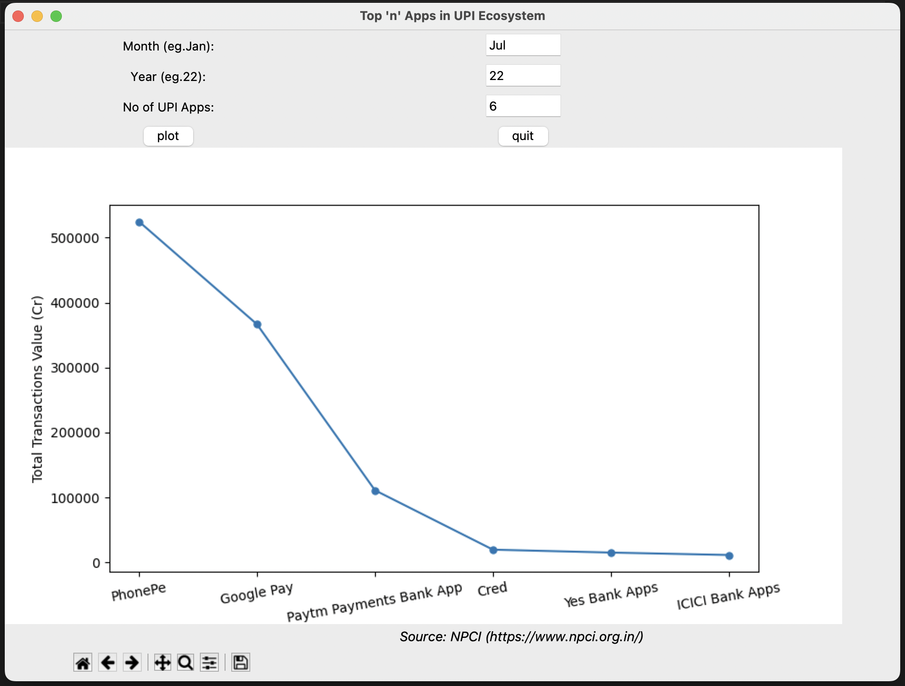

# Scraping-UPI-statistics

Plotting web scraped data of the UPI apps available in India. Enter the details in the described manner i.e First three letters of the month with the first word capitalized (Jan, Oct, Dec), Last two digits of the year and top 'n' apps with highest transaction value. The script works for data available from Apr 2021, prior to which div tag naming structure was different and hence existing script needs to be modified. The generated plot is embedded in Tkinter GUI using Matplotlib library and BeautifulSoup library is used for web scraping.



Based on the 'n' value, final stored data in python dictionary looks like this :
`{'PhonePe': 524742.49, 'Google Pay': 366669.09, 'Paytm Payments Bank App': 111149.66, 'Cred': 19716.43, 'Yes Bank Apps': 15236.04, 'ICICI Bank Apps': 11509.29}`

# Running

Install necessary python libraries as per _requirements.txt_ file and then run it

```
pip install -r requirements.txt
python3 final.py
```

Source of the data : https://www.npci.org.in/what-we-do/upi/upi-ecosystem-statistics [© NPCI]

Copyright Disclaimer under section 107 of the Copyright Act of 1976, allowance is made for “fair use” for purposes such as criticism, comment, news reporting, teaching, scholarship, education and research. Fair use is a use permitted by copyright statute that might otherwise be infringing.
